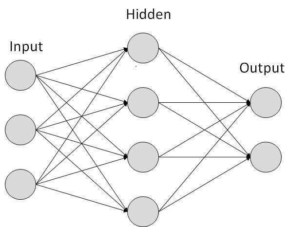

# Deep Learning

My deep learning  notes

## Terminology

| Term | Definition |
|:----:|:----------:|
| ANN  |  Artificial Neural Network  |
| Layer | Organized Neurons |
| Deep Network | A Network with more than one hidden layer |
| Activation Function | Non linear function that follows a dense layer |

### Other notes

model = net = neural network

neuron = node

## Layers

Layers are organized neurons.

Layers are sperated into 3 catagories

  - An input layer
  - one or more hidden layers
  - An output layer

Here is an image visualizing a network with s input layer made of 3 neurons, 1 hidden layer made up of 4 neurons, and a output layer made out of 2 neurons.



Differnt layers will perform differnt operations on data. Data flows from the input layer through the hidden layers until the output layer is reached.

How many neurons should I assign to each layer?

| Type | How to allocate |
|:----:|:----:|
| Input | One neuron for each component of input data |
| Hidden | Arbitrarily Chosen |
| Output | One node for each of the possible desired outcomes |

So how would we implement such a network in Keras? The following is a Keras implementation of the Neural network above

```python
from keras.models import Sequential
from keras.layers import Dense

model = Sequential([
    Dense(4, input_shape=(3,)),
    Dense(2)
])
```

The output of one layer is then passed to another and another, and soo on the output is computed with the following equation.


```python
output = activation(sum(weights))
```

this process is repeated over and over untill we reach the output layer. During this process weights will mutate in order to acheive optimized weighting for each connection. This is known as a foward pass.

### Activation Function

A activation function of a neuron defines  the output of the specified neuron given a set of inputs. Follows a layer.

Here are some exmaples of activation functions

#### Sigmoid


Formula


Python code

```python
from math import e

def sigmoid(x):
    return e**x / e**(x+1) 
```

### Example

Say we have a program that we want to identify if the image is of a cat or a dog. We would have 2 output nodes One representing a cat. And the other a dog.

# Keras

Keras is a simple API for describing neural networks

## Layers

### Dense

This is the most basic layer in a neural network. It connects it's inputs to it's outputs. This layer merely connects inputs to outputs within it's layer.

### Convolutional

Used for work with images

### Recurrent

Used for work with time series data.

## The Sequential Model

The sequential Model is a linear stack of layers i.e.

```python
# Import the Sequential Model
from keras.models import Sequential

model = Sequential([
    Dense(32, input_shape=(10,), activation='relu'),
    Dense(2, activation='softmax')
])
```